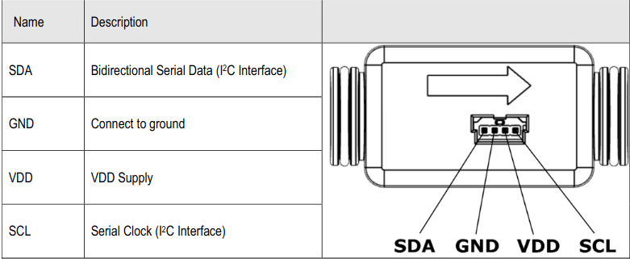

# Sensirion I2C SFM-SF06 Arduino Library

This is the Sensirion SFM-SF06 library for Arduino using the
modules I2C interface. This driver allows to control all sensors of the SFM-SF06 sensor family. 
The provided examples use the sensor *SFM3119* 
[<center></center>](./images/sfm3119.png).

The connector layout of this senor is shown in the figure below:
<center></center>


Other supported products of the sfm-sf06 sensor family are:

* SFM3003 
* SFM4300 
* SFM3119 
* SFM3013 
* SFM3019

To learn more about the sensors of the familiy sfm-sf06 [see](https://www.sensirion.com/flow-sensors)


# Installation

To install, download the latest release as .zip file and add it to your
[Arduino IDE](http://www.arduino.cc/en/main/software) via

	Sketch => Include Library => Add .ZIP Library...

Don't forget to **install the dependencies** listed below the same way via `Add
.ZIP Library`

Note: Installation via the Arduino Library Manager is coming soon.

# Dependencies

* [Sensirion Core](https://github.com/Sensirion/arduino-core)


# Quick Start

1. Connect the SFM-SF06 Sensor to your Arduino board's standard
   I2C bus. Check the pinout of your Arduino board to find the correct pins.
   The pinout of the SFM-SF06 Sensor can be found in the relevant
   data sheet.

The recommended voltage is 3.3V.

2. Open the `exampleUsage` sample project within the Arduino IDE via the application menu

		File => Examples => Sensirion I2C SFM-SF06 => exampleUsage

      Select the proper i2c address for your product as input parameter for the method *begin(..)*
      The list of i2c addresses is found in the header file *SensirionI2CSfmSf06.h*.

3. Click the `Upload` button in the Arduino IDE or

		Sketch => Upload

4. When the upload process has finished, open the `Serial Monitor` or `Serial
   Plotter` via the `Tools` menu to observe the measurement values. Note that
   the `Baud Rate` in the corresponding window has to be set to `115200 baud`.

# Contributing

**Contributions are welcome!**

We develop and test this driver using our company internal tools (version
control, continuous integration, code review etc.) and automatically
synchronize the master branch with GitHub. But this doesn't mean that we don't
respond to issues or don't accept pull requests on GitHub. In fact, you're very
welcome to open issues or create pull requests :)

This Sensirion library uses
[`clang-format`](https://releases.llvm.org/download.html) to standardize the
formatting of all our `.cpp` and `.h` files. Make sure your contributions are
formatted accordingly:

The `-i` flag will apply the format changes to the files listed.

```bash
clang-format -i src/*.cpp src/*.h
```

Note that differences from this formatting will result in a failed build until
they are fixed.

# License

See [LICENSE](LICENSE).
