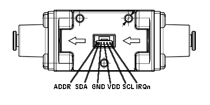

# Sensirion I²C SFM-SF06 Arduino Library

This is the Sensirion SFM-SF06 library for Arduino allowing you to 
communicate with a sensor of the SFM-SF06 family over I²C.


Click [here](https://sensirion.com/products/product-categories/gas-flow-sensors/) to learn more about the Sensirion SFM-SF06 sensor family.


Not all sensors of this driver family support all measurements.
In case a measurement is not supported by all sensors, the products that
support it are listed in the API description.


## Supported sensor types

| Sensor name   | I²C Addresses  |
| ------------- | -------------- |
|[SFM4300](https://sensirion.com/products/catalog/?filter_series=77ed9322-c043-4eaf-ad3c-2b55aae69cdd)| **0x2A**, 0x2B, 0x2C, 0x2D|
|[SFM3119](https://sensirion.com/products/catalog/SFM3119/)| **0x29**|
|[SFM3003](https://sensirion.com/products/catalog/SEK-SFM3003/)| **0x28**, 0x2D|
|[SFM3013](https://sensirion.com/products/catalog/SEK-SFM3013/)| **0x2F**|
|[SFM3019](https://sensirion.com/products/catalog/SEK-SFM3019/)| **0x2E**|

The following instructions and examples use a *SFM4300*.


## Installation of the library

This library can be installed using the Arduino Library manager:
Start the [Arduino IDE](http://www.arduino.cc/en/main/software) and open
the Library Manager via

`Sketch` ➔ `Include Library` ➔ `Manage Libraries...`

Search for the `Sensirion I2C SFM-SF06` library in the `Filter
your search...` field and install it by clicking the `install` button.

If you cannot find it in the library manager, download the latest release as .zip file 
and add it to your [Arduino IDE](http://www.arduino.cc/en/main/software) via

`Sketch` ➔ `Include Library` ➔ `Add .ZIP Library...`

Don't forget to **install the dependencies** listed below the same way via library 
manager or `Add .ZIP Library`

#### Dependencies
* [Sensirion Core](https://github.com/Sensirion/arduino-core)

## Sensor wiring

Use the following pin description to connect your SFM-SF06 to the standard I²C bus of your Arduino board:



| *Pin* | *Cable Color* | *Name* | *Description*  | *Comments* |
|-------|---------------|:------:|----------------|------------|
| 1 |  | ADDR |  | see data sheet section 4.1
| 2 |  | SDA | I2C: Serial data input / output | Serial data, bidirectional
| 3 |  | GND | Ground | 
| 4 |  | VDD | Supply Voltage | 3.0V to 5.0V
| 5 |  | SCL | I2C: Serial clock input | 
| 6 |  | IRQn |  | Active low. see data sheet section 3.3


The recommended voltage is 3.3V.

### Board specific wiring
You will find pinout schematics for recommended board models below:


<details><summary>Arduino Uno</summary>
<p>

| *SFM-SF06* | *SFM-SF06 Pin* | *Cable Color* | *Board Pin* |
| :---: | --- | --- | --- |
| ADDR | 1 |  |  |
| SDA | 2 |  | D18/SDA |
| GND | 3 |  | GND |
| VDD | 4 |  | 3.3V |
| SCL | 5 |  | D19/SCL |
| IRQn | 6 |  |  |


</p>
</details>


<details><summary>Arduino Nano</summary>
<p>

| *SFM-SF06* | *SFM-SF06 Pin* | *Cable Color* | *Board Pin* |
| :---: | --- | --- | --- |
| ADDR | 1 |  |  |
| SDA | 2 |  | A4 |
| GND | 3 |  | GND |
| VDD | 4 |  | 3.3V |
| SCL | 5 |  | A5 |
| IRQn | 6 |  |  |


</p>
</details>


<details><summary>Arduino Micro</summary>
<p>

| *SFM-SF06* | *SFM-SF06 Pin* | *Cable Color* | *Board Pin* |
| :---: | --- | --- | --- |
| ADDR | 1 |  |  |
| SDA | 2 |  | D2/SDA |
| GND | 3 |  | GND |
| VDD | 4 |  | 3.3V |
| SCL | 5 |  | ~D3/SCL |
| IRQn | 6 |  |  |


</p>
</details>


<details><summary>Arduino Mega 2560</summary>
<p>

| *SFM-SF06* | *SFM-SF06 Pin* | *Cable Color* | *Board Pin* |
| :---: | --- | --- | --- |
| ADDR | 1 |  |  |
| SDA | 2 |  | D20/SDA |
| GND | 3 |  | GND |
| VDD | 4 |  | 3.3V |
| SCL | 5 |  | D21/SCL |
| IRQn | 6 |  |  |


</p>
</details>


<details><summary>ESP32 DevKitC</summary>
<p>

| *SFM-SF06* | *SFM-SF06 Pin* | *Cable Color* | *Board Pin* |
| :---: | --- | --- | --- |
| ADDR | 1 |  |  |
| SDA | 2 |  | GPIO 21 |
| GND | 3 |  | GND |
| VDD | 4 |  | 3V3 |
| SCL | 5 |  | GPIO 22 |
| IRQn | 6 |  |  |


</p>
</details>


## Quick Start

1. Install the libraries and dependencies according to [Installation of the library](#installation-of-the-library)

2. Connect the SFM-SF06 sensor to your Arduino as explained in [Sensor wiring](#sensor-wiring)

3. Open the `exampleUsage` sample project within the Arduino IDE:

   `File` ➔ `Examples` ➔ `Sensirion I2C SFM-SF06` ➔ `exampleUsage`

  
   The provided example is working with a SFM4300, I²C address 0x2A.
   In order to use the code with another product or I²C address you need to change it in the code of `examples/exampleUsage`. 
   You find the list with pre-defined addresses in `src/SensirionI2CSfmSf06.h`.


5. Click the `Upload` button in the Arduino IDE or `Sketch` ➔ `Upload`

4. When the upload process has finished, open the `Serial Monitor` or `Serial
   Plotter` via the `Tools` menu to observe the measurement values. Note that
   the `Baud Rate` in the used tool has to be set to `115200 baud`.

## Contributing

**Contributions are welcome!**

We develop and test this driver using our company internal tools (version
control, continuous integration, code review etc.) and automatically
synchronize the master branch with GitHub. But this doesn't mean that we don't
respond to issues or don't accept pull requests on GitHub. In fact, you're very
welcome to open issues or create pull requests :)

This Sensirion library uses
[`clang-format`](https://releases.llvm.org/download.html) to standardize the
formatting of all our `.cpp` and `.h` files. Make sure your contributions are
formatted accordingly:

The `-i` flag will apply the format changes to the files listed.

```bash
clang-format -i src/*.cpp src/*.h
```

Note that differences from this formatting will result in a failed build until
they are fixed.


## License

See [LICENSE](LICENSE).
